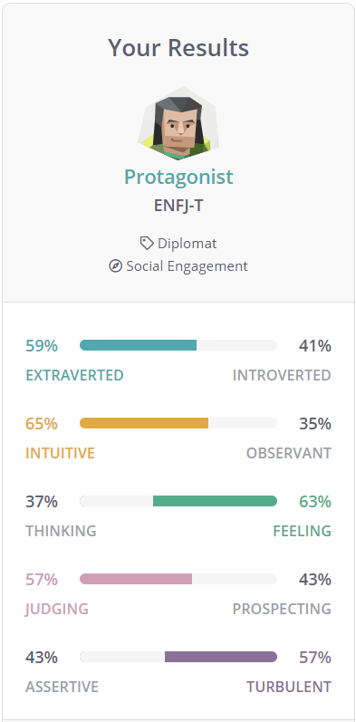
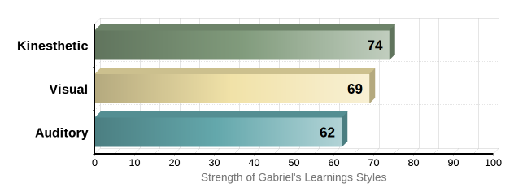
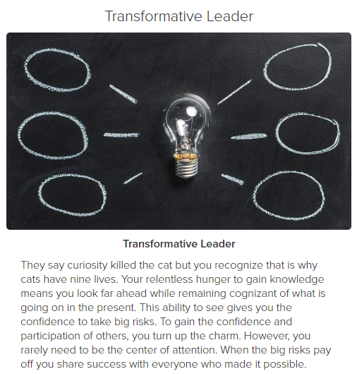

<h1> Introduction</h1>

Name:                  Gabriel Duke

RMIT Student Number:   s3785307

Student Email Address: s3785307@student.rmit.edu.au

 A picture of my friends and I (center) celebrating Christmas! 

<h2>A bit about me</h2>

Born and raised in Melbourne Australia! I graduated from high school VCE in 2018 and am currently undertaking a Bachelor of Science (Biology) at the Royal Melbourne Institute of Technology 

 Interesting Fact! If you cannot find me on campus or at the gym, you can find me reading comic books or collecting rare Australian coins! (Coin collectors are called Numismatists) 

<h2> Interest in IT </h2>

 <b> What is your Interest in IT? </b>Was there any particular event or person that sparked your interest? Outline your IT experience: My best friend Edward is studying computer science, through it he does lots of interesting things like designing apps and editing software, I thought it looked like a fun idea, but a practical application of that seemed to lie in IT. I actually have 0 experience in IT, hence why I am taking this elective! 

 <b>Why did you choose to come to RMIT?</b> I chose to go to RMIT because my ATAR fit perfectly with RMIT’s expectations, and it was an easy campus to get to from my house 

 <b>What do you expect to learn during your studies?</b> I expect to learn lots about biology! I expect that my degree will equip me with enough surface and depth knowledge to discuss the possibilities and implications of modern biotechnology. For IT I expect to learn the basics around what information technology is and how I can apply that to the world

<h2> Ideal Job </h2>

 Teaching biology at a high school level would be absolute dream job. The idea of inspiring teenagers to the wonders of how life works and along the way helping teenagers find themselves among the mess of life excites me. An opportunity to undertake this occupation has been my goal for a while, and I will continue to pursue it. 
  The skills needed to do this job well, require me to be a specialist in my field, through completing a Bachelor of Science (Biology). It will also require me to be a qualified science educator, which would mean I would need to undertake a Master of Teaching Practice (Secondary Education). Through doing that I can register as a teacher with the Victorian institute of teaching and go from there into my dream job. 
  I am currently undertaking the Bachelor of Science (Biology) required prior to my Masters. If I continue to work hard and continue completing units at RMIT, I will be qualified in no time!
  Here is an example of the job I would like in the future and a link to it! 

<a href="https://www.seek.com.au/job/51546262?type=promoted#searchRequestToken=93928be5-015a-48ea-830d-649c9955f7b2">
Link to my dream job
</a>
 

<h2> Personal Info </h2>

Below are some of the results I have done for some personal tests in regards to my personality/learning style/and leadership type 

 <b> Myers-Brigss test result </b> 

 <b> Learning Style Test </b> 

 
<a href="https://personalitymax.com/learning-styles/">
Link to learning style test
</a>
 

 <b> Leadership style test </b> 

  
<a href="https://eml.usc.edu/leadership-style-quiz">
Link to Leading style test
</a>

 <b> What do these results mean for you? </b> 

 These results in actuality do not mean a lot for me, personality tests time and time again have been disproven to mean a whole lot about mapping out humans and aren't a big key to figuring out ourselves as we are more diverse than this. However, these tests are healthy for us to learn a bit about how we fit into a team dynamic, or how we can be best suited to work at the current time! Being the ENFJ Protagonist for the Myers-Briggs test was no surprise, I usually switch between that and an ENFP or ENTP. Being a kinesthetic learner simply means that I learn a lot from doing things rather than listening to people talk about things, or by seeing people do it themselves. Being a "Transformative Leader" is a strange and enlightening description of the way I lead, I agree with most of the descriptions and think they are all healthy ways to lead others! 

 <b> How do you think these results may influence your behaviour in a team? </b> 

 Being an extravert, it allows me to communicate effectively in a friendly manner with a team. The ‘protagonist’ ENFJ Myers-Briggs result says I am a natural leader, and in some ways that’s correct, and I tend to spearhead ideas in the group, and help others reach their goals by providing them decisive decisions to what they should be doing. Being a kinesthetic learner also helps me to get things going by simply working my way through them. and being a "Transformative leader" should help me to share the teams success and help other team members feel valued 

 <b> How should you take this into account when forming a team? </b> 

 When forming a team, I need to consider that other people may have differing opinions/ideas to mine, and I need to be ok with that! Protagonists/ENFJ’s tend to want to lead, and do not enjoy being led by people they don’t agree with. So, I need to regularly check myself and know that others will provide great ideas and interesting paths for the team to go down.  

 
<h1> Project Idea </h1>
<h2> Overview </h2>

 My project idea is to begin building a database for comic book readers, this database would contain information for comic books readers that would allow for continuity, author, artist, release date, tie-ins, standalone stories, and appearances in other comics. The idea would be to begin with the DC Comics universe but would eventually expand to other publishing companies including Marvel, IDW, Dark Horse, Onipress, and more. This database would allow individuals to input a profile that would let them update their reading lists and show them suggestions like “What to read next” or “More from this author”. Another idea for this database would be to include local comic book shops in your area, with contact details, addresses, and stock options to see if certain stores have the books you are looking for available.

<h2> Motivation </h2>

 The motivation behind a project like this comes from a lack of a centralized database like this out there (that I know of!). Every type of Wikipedia or reading list I have tried to access simply doesn’t have the information I need in order to find the next comic book I want to read, and while some work for small parts, there is no centralized place for me to look for sequels, or tie-ins that I would be interested in. And so, by creating a comic book database, comic book fans and collectors can increase their library, and be able to tick off lists of do or don’t have. And it can show a good place for people to start who are new to comic books 

<h2> Description </h2>

 The project should be held as an app or could be done on a website (the two of which could sync up and be used together). The overview would be a very clean UI and simple, identifying the main sections
 -Search 
 -Publishers (DC, Marvel, etc)
 -Authors
 -Ages (“Golden Age”, “Silver Age” etc) 
 -Characters
 -Profile
 -Stores near me
 Upon choosing a section, it would take the user to another page which would provide further information, for all sections other than Profile and stores near me, the user will be able to find a specific comic, and it would lead them to a reading list of what comes next, what came before it, who wrote it, who drew it, etc. The information is not designed to be a Wikipedia page, it will not contain an in-depth synopsis of plot, but instead just the blurb included on the physical comics, in order to show readers what the book is about.
  When clicking on the profile button, it will take the user to their personal account page that would display their personal library that they can update, add a reading list, and be shown recommended comics that would relate to their current reading trends.
 The “stores near me” link, would show users where comic book dealers in their neighborhood are and provide basic details about that store (address, store hours, etc), this could all be done by incorporating google maps or bing maps, or another map service, rather than building our own for the project.
 The Authors page will provide links to all of that authors works, along with a short bio to be referenced from Wikipedia.
 The Characters page will include both comic book heroes and villains and will provide a detailed list of where they appear throughout the comic book universe.
 It comic pages individually should also state whether the comics are ‘’in print’’ (meaning they are still being made) or if they are no longer ‘’in print’’. This should prepare and help comic book readers to know if their regular shop will be able to order it in, or if they will need to hunt especially for the rare comics.
 The website will also include a coming soon tab, to show which comics that the user has been reading, will be coming out soon, which will allow users to prepare, pre order, or by in store new comics from the ones they find on the map locally. Doing this will add business and relativity to use the project regularly as opposed to once off. Also, by following a specific author, users can be notified as to when that author puts out a new comic, or is working on a new series 

<h2> Tools & Technologies </h2>

 If this were to be done on a website and an app that were linked together, the tools required would be the internet, and a computer containing a processor, memory, and a hard drive, capable of coding and hosting the data stored on a server which would have all the info on it. Being able to link the website and the app together in sync would also require some form of hardware to make them both be online and updating each other simultaneously. 

<h2> Skills required </h2>

 The skills required would be HTML and some form of app building language like JavaScript. I am unsure what is required to link the two of them together as I have zero experience in coding, but it can be done. Finding the skills required would be relatively easy as I could hire someone with the skills to build it. The required hardware would be a computer for writing the code, and a server to store it all on. Internet would be required to gather the information for the comics, their release dates, authors etc. 

<h2> Outcome </h2>

 If this project is successful, it will have a positive outcome for comic book readers. Anecdotally, I find it really hard to know what comic to read next, as the industry is always updating and changing things, so a timeline would help me, and other comic fans know exactly what’s next and help us to know what we need to read from other authors in order to understand what we will read in the future. It will also help comic book readers to connect with their local shops. Too often do people buy their comics online, and the stores are left with no culture. So, if this project is a success, good things to come for the comic book industry all around for consumers, and producers!

